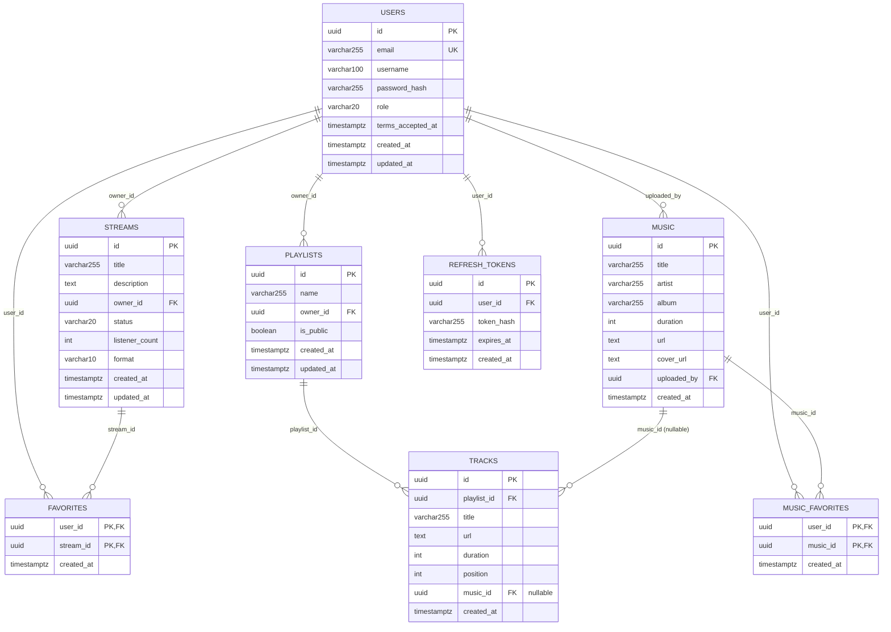

# Schema de la base de donnees

Ce document decrit la structure des donnees de StreamPulse : modele
conceptuel (entites-associations), modele physique (tables reelles) et
dictionnaire de donnees. Il repond au critere **Ce3.6.1** du bloc 3
(RNCP 38822), qui exige que la documentation technique decrive la
structure des bases de donnees — jusqu'ici seules les migrations SQL
existaient, sans schema entites-associations documente. Voir aussi les
[user stories](user-stories.md), le [schema de securite](securite.md) et
les [diagrammes UML/BPMN](diagrammes.md). Une synthese en anglais figure
en fin de document.

La source de verite executable reste les migrations
(`backend/internal/infrastructure/postgres/migrations/001` a `006`,
outil `golang-migrate`) : ce document en est la lecture entites-associations
et le dictionnaire, il ne s'y substitue pas.

## 1. Modele conceptuel de donnees (MCD)

Methode Merise : entites, identifiants, associations et cardinalites
(`0,1` `1,1` `0,n` `1,n`), independamment de toute table SQL.

### Entites et identifiants

| Entite | Identifiant | Proprietes |
|--------|-------------|------------|
| `UTILISATEUR` | `id` | email, nom_utilisateur, hash_mot_de_passe, role, date_acceptation_cgu, date_creation, date_maj |
| `FLUX` | `id` | titre, description, statut, nb_auditeurs, format, date_creation, date_maj |
| `PLAYLIST` | `id` | nom, est_publique, date_creation, date_maj |
| `PISTE` | `id` | titre, url, duree, position |
| `MORCEAU` | `id` | titre, artiste, album, duree, url, url_pochette, date_creation |
| `JETON_RAFRAICHISSEMENT` | `id` | hash_jeton, date_expiration, date_creation |

### Associations et cardinalites

| Association | Entites liees | Cardinalites | Sens |
|-------------|---------------|--------------|------|
| POSSEDE_FLUX | UTILISATEUR — FLUX | `1,1` — `0,n` | Un utilisateur possede zero ou plusieurs flux ; un flux appartient a exactement un utilisateur (`role >= broadcaster` au moment de la creation). |
| POSSEDE_PLAYLIST | UTILISATEUR — PLAYLIST | `1,1` — `0,n` | Une playlist a exactement un proprietaire ; un utilisateur possede zero ou plusieurs playlists. |
| COMPOSE | PLAYLIST — PISTE | `1,1` — `0,n` | Une piste appartient a exactement une playlist, positionnee (`position`) ; une playlist contient zero ou plusieurs pistes. |
| REFERENCE | PISTE — MORCEAU | `0,1` — `0,n` | Une piste peut referencer un morceau du catalogue (ou porter sa propre URL en autonome) ; un morceau peut etre reference par plusieurs pistes. |
| DEPOSE | UTILISATEUR — MORCEAU | `1,1` — `0,n` | Un morceau est depose par exactement un utilisateur ; un utilisateur depose zero ou plusieurs morceaux. |
| FAVORI_FLUX | UTILISATEUR — FLUX | `0,n` — `0,n` | Association porteuse d'une date (`date_ajout`) : un utilisateur met en favori plusieurs flux, un flux est mis en favori par plusieurs utilisateurs. |
| FAVORI_MORCEAU | UTILISATEUR — MORCEAU | `0,n` — `0,n` | Meme lecture pour les morceaux. |
| DETIENT_JETON | UTILISATEUR — JETON_RAFRAICHISSEMENT | `1,1` — `0,n` | Un jeton appartient a exactement un utilisateur ; un utilisateur peut detenir plusieurs jetons (multi-appareil), tous revoques a chaque connexion ([ADR 006](ADR/006-strategie-auth-jwt.md)). |

### Regles de gestion

- RG-01 : le role d'un utilisateur est l'une des quatre valeurs
  `anonymous`, `user`, `broadcaster`, `admin` (`anonymous` n'est jamais
  persiste : c'est l'absence de compte).
- RG-02 : le statut d'un flux est l'une des trois valeurs `idle`, `live`,
  `ended`, sans retour possible depuis `ended` (diagramme d'etats,
  [diagrammes.md](diagrammes.md#5-etats-dun-flux)).
- RG-03 : la position d'une piste au sein d'une playlist est unique par
  playlist (recalculee atomiquement a chaque reordonnancement,
  `TestPlaylistRepo_ReorderIsAtomic`).
- RG-04 : l'effacement d'un utilisateur entraine l'effacement de tout ce
  qu'il possede (flux, playlists, pistes, morceaux, favoris, jetons) —
  effacement physique en cascade, jamais logique
  ([ADR 007](ADR/007-effacement-compte-rgpd.md)).
- RG-05 : la suppression d'un morceau reference par des pistes ne supprime
  pas ces pistes ; elles perdent seulement la reference (`music_id`
  devient `NULL`), la piste conserve son titre et son URL propres.

---

## 2. Modele physique de donnees (MPD)

Traduction du MCD en schema relationnel PostgreSQL 16
([ADR 005](ADR/005-choix-postgresql.md)). Chaque cle primaire est un
`UUID` genere cote base (`uuid_generate_v4()`), choix qui evite
d'exposer un identifiant sequentiel devinable dans les URLs de l'API.

`FAVORITES` et `MUSIC_FAVORITES` sont des tables d'association pures : la
cle primaire composite (`user_id`, `stream_id` / `music_id`) porte a elle
seule la contrainte d'unicite "un favori par paire", sans colonne `id`
technique.

---

## 3. Dictionnaire de donnees

### `users` (migrations 001, 006)

| Colonne | Type | Contraintes | Description |
|---------|------|-------------|--------------|
| `id` | `UUID` | PK, defaut `uuid_generate_v4()` | Identifiant du compte |
| `email` | `VARCHAR(255)` | `UNIQUE NOT NULL`, indexe | Identifiant de connexion |
| `username` | `VARCHAR(100)` | `NOT NULL` | Nom affiche |
| `password_hash` | `VARCHAR(255)` | `NOT NULL` | bcrypt, cout 12, jamais renvoye par l'API |
| `role` | `VARCHAR(20)` | `NOT NULL DEFAULT 'user'`, indexe | `user`, `broadcaster` ou `admin` |
| `terms_accepted_at` | `TIMESTAMPTZ` | `NOT NULL DEFAULT NOW()` | Preuve de consentement aux CGU (RG obligation de rendre compte, art. 5.2 RGPD) |
| `created_at` / `updated_at` | `TIMESTAMPTZ` | `NOT NULL DEFAULT NOW()` | Horodatage |

### `refresh_tokens` (migration 001)

| Colonne | Type | Contraintes | Description |
|---------|------|-------------|--------------|
| `id` | `UUID` | PK | Identifiant technique |
| `user_id` | `UUID` | `NOT NULL REFERENCES users(id) ON DELETE CASCADE`, indexe | Proprietaire |
| `token_hash` | `VARCHAR(255)` | `NOT NULL`, indexe | SHA-256 du refresh token opaque (jamais le jeton en clair) |
| `expires_at` | `TIMESTAMPTZ` | `NOT NULL` | 168 h apres emission (`JWT_REFRESH_EXPIRY`) |
| `created_at` | `TIMESTAMPTZ` | `NOT NULL DEFAULT NOW()` | Horodatage |

### `streams` (migration 002)

| Colonne | Type | Contraintes | Description |
|---------|------|-------------|--------------|
| `id` | `UUID` | PK | Identifiant du flux |
| `title` | `VARCHAR(255)` | `NOT NULL` | Titre affiche |
| `description` | `TEXT` | nullable | Description libre |
| `owner_id` | `UUID` | `NOT NULL REFERENCES users(id) ON DELETE CASCADE`, indexe | Diffuseur proprietaire |
| `status` | `VARCHAR(20)` | `NOT NULL DEFAULT 'idle'`, indexe | `idle`, `live`, `ended` |
| `listener_count` | `INT` | `NOT NULL DEFAULT 0` | Compteur en direct (Hub), pas une agregation SQL |
| `format` | `VARCHAR(10)` | `NOT NULL DEFAULT 'mp3'` | Format audio du flux |
| `created_at` / `updated_at` | `TIMESTAMPTZ` | `NOT NULL DEFAULT NOW()` | Horodatage |

### `playlists` et `tracks` (migration 003, `music_id` ajoute en 004)

| Table | Colonne | Type | Contraintes | Description |
|-------|---------|------|-------------|--------------|
| `playlists` | `id` | `UUID` | PK | Identifiant |
| `playlists` | `name` | `VARCHAR(255)` | `NOT NULL` | Nom |
| `playlists` | `owner_id` | `UUID` | `NOT NULL REFERENCES users(id) ON DELETE CASCADE`, indexe | Proprietaire |
| `playlists` | `is_public` | `BOOLEAN` | `NOT NULL DEFAULT false` | Visible dans `GET /playlists/public` |
| `tracks` | `id` | `UUID` | PK | Identifiant |
| `tracks` | `playlist_id` | `UUID` | `NOT NULL REFERENCES playlists(id) ON DELETE CASCADE`, indexe | Playlist parente |
| `tracks` | `title` / `url` / `duration` | — | `NOT NULL` | Metadonnees propres a la piste (independantes de `music`) |
| `tracks` | `position` | `INT` | `NOT NULL DEFAULT 0` | Ordre dans la file d'attente, unique par playlist (RG-03) |
| `tracks` | `music_id` | `UUID` | `REFERENCES music(id) ON DELETE SET NULL` | Reference optionnelle au catalogue |

### `music` (migration 004)

| Colonne | Type | Contraintes | Description |
|---------|------|-------------|--------------|
| `id` | `UUID` | PK | Identifiant du morceau |
| `title`, `artist`, `album` | `VARCHAR(255)` | `NOT NULL DEFAULT ''` (artist, album) | Metadonnees, indexees en plein texte (`gin(to_tsvector('english', ...))`) pour `GET /music/search` |
| `duration` | `INT` | `NOT NULL DEFAULT 0` | Duree en secondes |
| `url` | `TEXT` | `NOT NULL` | Fichier uploade (`/uploads/...`) ou URL externe |
| `cover_url` | `TEXT` | nullable | Pochette |
| `uploaded_by` | `UUID` | `NOT NULL REFERENCES users(id) ON DELETE CASCADE`, indexe | Diffuseur ayant depose le morceau |
| `created_at` | `TIMESTAMPTZ` | `NOT NULL DEFAULT NOW()`, indexe (`DESC`) | Tri par recence |

### `favorites` et `music_favorites` (migrations 003, 005)

| Table | Colonnes (PK composite) | Description |
|-------|--------------------------|--------------|
| `favorites` | `user_id`, `stream_id` (FK `ON DELETE CASCADE` sur les deux) | Un flux favori par utilisateur |
| `music_favorites` | `user_id`, `music_id` (FK `ON DELETE CASCADE` sur les deux) | Un morceau favori par utilisateur |

Les deux tables portent en plus `created_at` pour trier les favoris par
date d'ajout.

---

## 4. Index et performance

| Index | Table | Usage |
|-------|-------|-------|
| `idx_users_email` | `users(email)` | Recherche a la connexion |
| `idx_users_role` | `users(role)` | Filtrage RBAC cote administration |
| `idx_refresh_tokens_hash` | `refresh_tokens(token_hash)` | Verification a chaque `POST /auth/refresh` |
| `idx_refresh_tokens_user` | `refresh_tokens(user_id)` | Revocation en masse (login, refresh, effacement) |
| `idx_streams_owner` | `streams(owner_id)` | "Mes flux" cote diffuseur |
| `idx_streams_status` | `streams(status)` | `GET /streams` filtre sur les flux `live` |
| `idx_playlists_owner` | `playlists(owner_id)` | "Mes playlists" |
| `idx_tracks_playlist` | `tracks(playlist_id)` | Chargement d'une playlist |
| `idx_music_uploaded` | `music(uploaded_by)` | Catalogue d'un diffuseur |
| `idx_music_created` | `music(created_at DESC)` | Liste triee par recence |
| `idx_music_search_title`, `idx_music_search_artist` | `music` | Recherche plein texte (`gin`) |

Aucun index n'est pose sur `favorites` / `music_favorites` au-dela de leur
cle primaire composite : les deux colonnes qui la composent couvrent deja
les deux sens de recherche (favoris d'un utilisateur, utilisateurs ayant
mis un element en favori).

---

## Summary (English)

This document specifies StreamPulse's data structure at two levels: a
Merise-style conceptual model (entities, identifiers, associations with
cardinalities, independent of any SQL table) and its physical translation
into the six PostgreSQL migrations that actually run, rendered as a
Mermaid ER diagram. A full data dictionary follows, table by table, with
every column, constraint, foreign key and index, plus the five governing
business rules (role/status enums, unique track position per playlist,
cascading physical erasure on account deletion, and the non-cascading
`music_id` reference from tracks). It answers criterion **Ce3.6.1** of
RNCP 38822 block 3 — the SQL migrations alone were not a documented
conceptual model — alongside [user-stories.md](user-stories.md),
[securite.md](securite.md) and [diagrammes.md](diagrammes.md).
