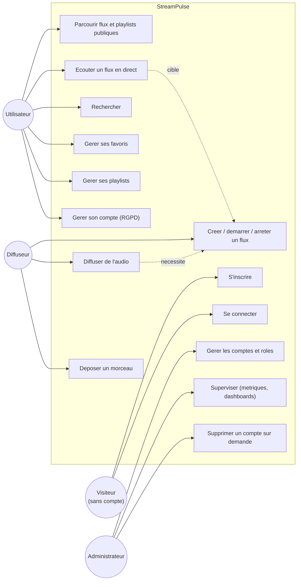
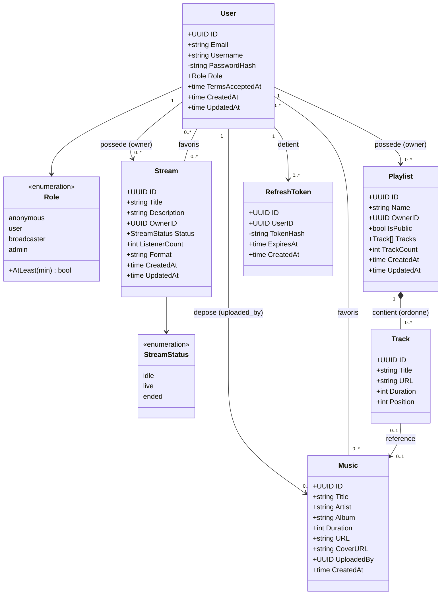
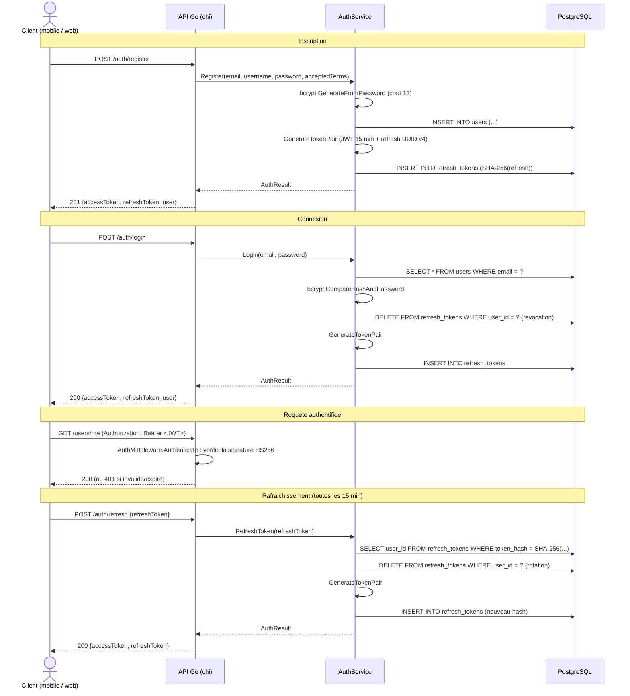
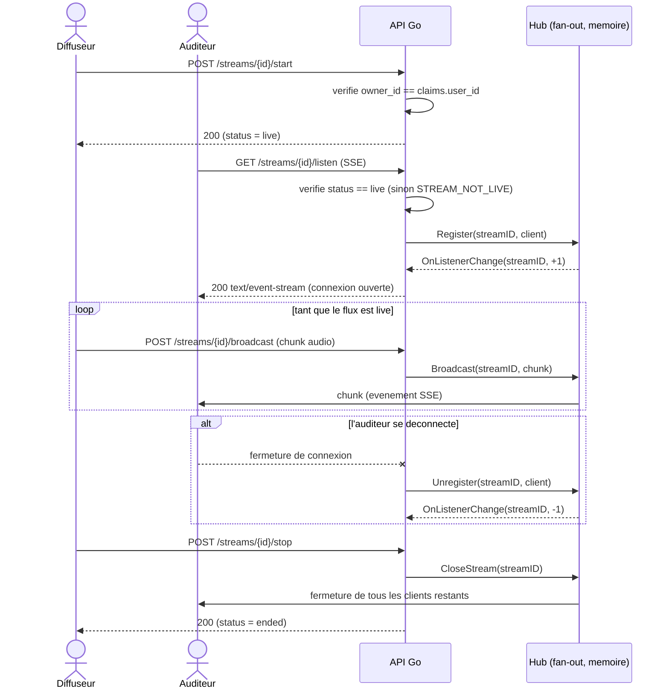
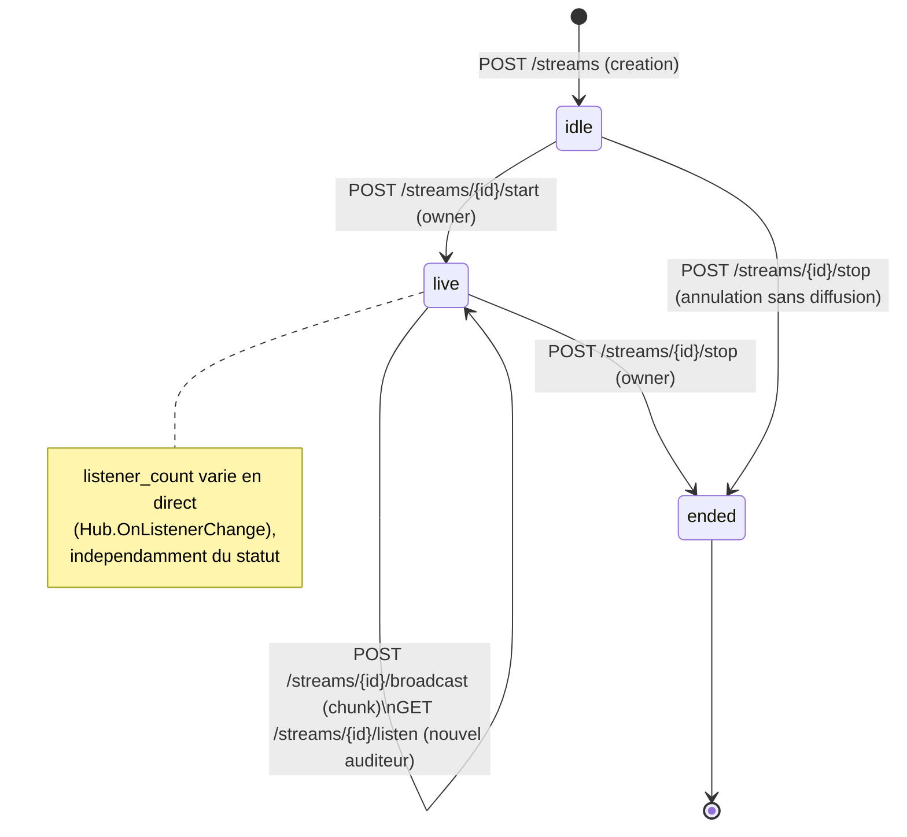
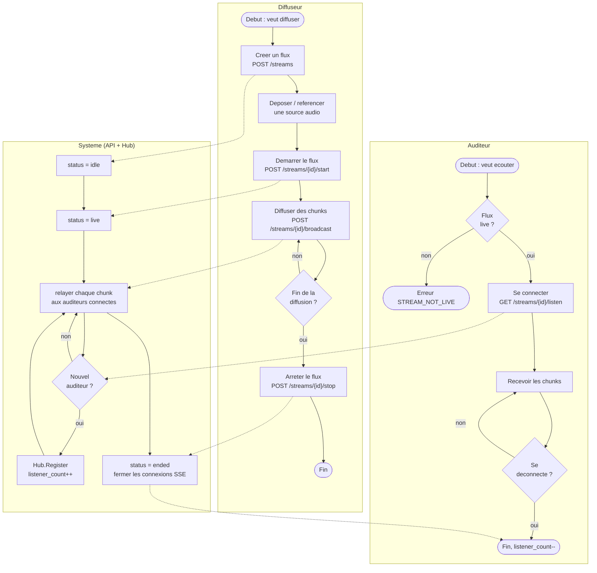
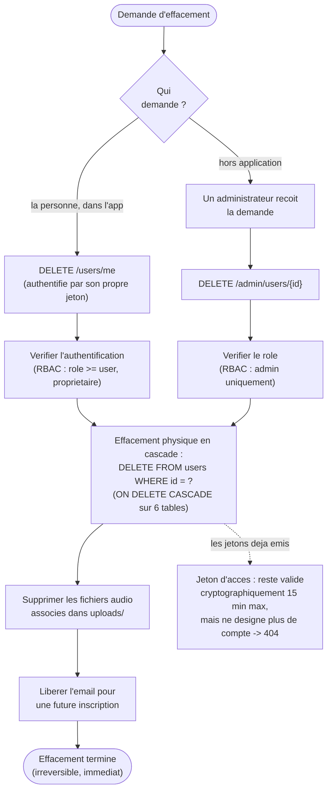
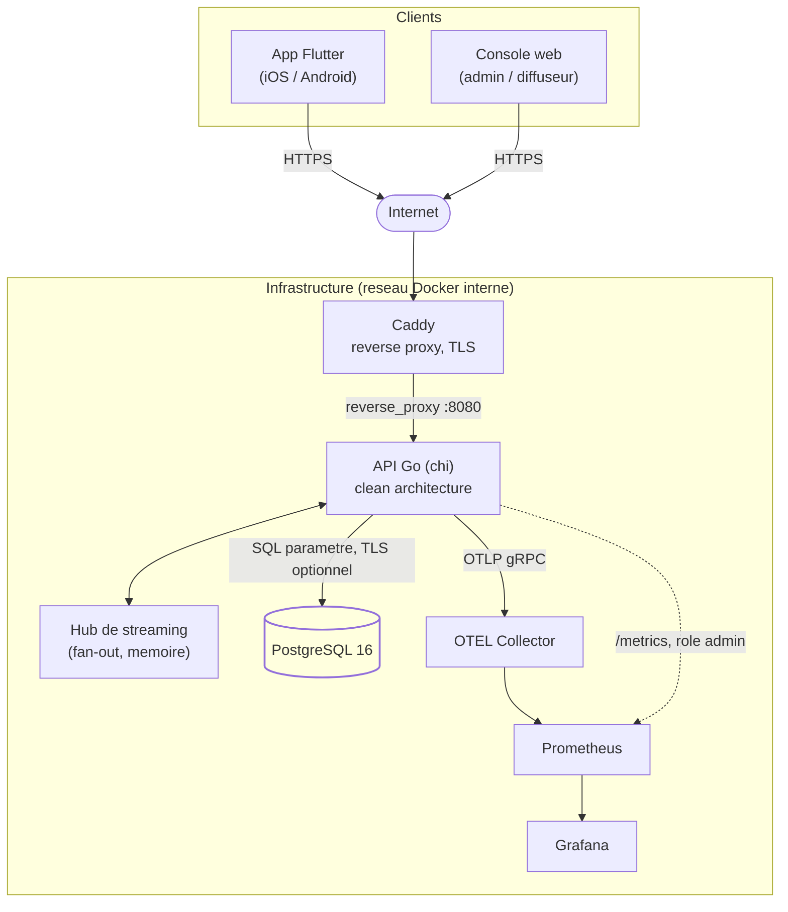

# Diagrammes UML et BPMN

Ce document rassemble les diagrammes standardises decrivant StreamPulse :
cas d'usage, classes du domaine, sequences, etats, processus metier (BPMN)
et composants techniques. Il repond au critere **Ce3.6.1** du bloc 3
(RNCP 38822), qui exige un langage de visualisation standardise (UML,
BPMN) en complement des [user stories](user-stories.md), du
[schema de base de donnees](base-de-donnees.md) et du
[schema de securite](securite.md). Une synthese en anglais figure en fin
de document.

Tous les diagrammes sont ecrits en [Mermaid](https://mermaid.js.org/), qui
s'affiche nativement sur GitHub sans outil externe. Mermaid n'a pas de
rendu natif pour les notations UML "cas d'usage" ou BPMN avec couloirs :
ces deux diagrammes sont donc approximes avec `flowchart` (acteurs et
sous-graphes en guise de couloirs), en restant fideles a la semantique
(acteurs, activites, decisions, evenements). Les diagrammes de classes,
sequence et etats utilisent en revanche la syntaxe UML native de Mermaid.

## Sommaire

1. [Cas d'usage](#1-cas-dusage)
2. [Classes du domaine](#2-classes-du-domaine)
3. [Sequence — inscription, connexion, rafraichissement](#3-sequence--inscription-connexion-rafraichissement)
4. [Sequence — ecoute d'un flux en direct (SSE)](#4-sequence--ecoute-dun-flux-en-direct-sse)
5. [Etats d'un flux](#5-etats-dun-flux)
6. [BPMN — cycle de vie d'une diffusion](#6-bpmn--cycle-de-vie-dune-diffusion)
7. [BPMN — effacement de compte (RGPD)](#7-bpmn--effacement-de-compte-rgpd)
8. [Composants et deploiement](#8-composants-et-deploiement)

---

## 1. Cas d'usage

Vue synthetique des interactions entre les trois roles et le systeme, plus
le visiteur qui n'a pas encore de compte. **L'application n'offre aucune
consultation sans compte** : `mobile/lib/app/router.dart` redirige toute
route non authentifiee vers l'ecran de connexion, seuls l'inscription et la
connexion sont atteignables avant d'avoir un compte. Chaque role herite
ensuite des cas d'usage du role precedent (`user` < `broadcaster` <
`admin`, [ADR 006](ADR/006-strategie-auth-jwt.md)) ; seuls les cas propres
a chaque role sont rattaches a lui pour la lisibilite.

> **Nuance API.** Le contrat REST expose reellement `GET /streams`,
> `GET /music` et `GET /search` sans jeton ([securite.md](securite.md#4-authentification-et-autorisation)) :
> un client tiers integre directement a l'API pourrait donc parcourir ces
> listes sans compte. Aucun ecran de l'application livree n'emprunte ce
> chemin — ce diagramme decrit le produit tel qu'on l'utilise, pas les
> capacites brutes de l'API.

Traçabilite vers les [user stories](user-stories.md) : `UC1-UC2` → US-01,
US-02 ; `UC3-UC4` → US-06, US-07 ; `UC5-UC8` → US-07 a US-09, US-04, US-05 ;
`UC9-UC11` → US-10, US-11 ; `UC12-UC14` → US-12 a US-14.

---

## 2. Classes du domaine

Modele des entites metier telles que definies dans `backend/internal/domain/`
(clean architecture, [ADR 001](ADR/001-clean-architecture.md)) : zero
dependance externe, uniquement des structures et des regles. Ce diagramme
est le pendant objet du [modele de donnees](base-de-donnees.md) ; il porte
les comportements (validite d'un role, d'un statut) que le schema
relationnel ne peut pas exprimer.

---

## 3. Sequence — inscription, connexion, rafraichissement

Flux d'authentification complet, cote sans etat serveur
([ADR 006](ADR/006-strategie-auth-jwt.md)) : le jeton d'acces porte les
claims, le refresh token est opaque et stocke hache.

---

## 4. Sequence — ecoute d'un flux en direct (SSE)

Diffusion en fan-out via le `Hub` en memoire ([ADR 003](ADR/003-streaming-sse.md)).
Le serveur reste sans etat partage : chaque instance API porte son propre
`Hub`, ce qui borne la scalabilite horizontale a une repartition par flux
(documente dans [scalability.md](scalability.md)).

---

## 5. Etats d'un flux

Cycle de vie de `Stream.Status`, dont les transitions valides sont
imposees par `application/stream_service.go` (pas de retour arriere depuis
`ended`).

---

## 6. BPMN — cycle de vie d'une diffusion

Processus metier de bout en bout, du point de vue du diffuseur et des
auditeurs. Represente en couloirs (`subgraph`) faute de support BPMN natif
dans Mermaid ; les losanges figurent les portes de decision (gateways), les
rectangles arrondis les evenements de debut/fin.

---

## 7. BPMN — effacement de compte (RGPD)

Processus d'exercice du droit a l'effacement (art. 17 RGPD), initie par la
personne elle-meme ou par un administrateur en son nom
([ADR 007](ADR/007-effacement-compte-rgpd.md)).

---

## 8. Composants et deploiement

Vue des conteneurs et de leurs communications, en production
(`docker-compose.prod.yml`, `caddy/Caddyfile`). Le detail des zones de
confiance et des controles de securite associes est dans
[securite.md](securite.md#2-cartographie-des-flux-et-zones-de-confiance).

---

## Summary (English)

This document collects the standardised diagrams describing StreamPulse in
Mermaid syntax, satisfying criterion **Ce3.6.1** alongside
[user-stories.md](user-stories.md), [base-de-donnees.md](base-de-donnees.md)
and [securite.md](securite.md): a use-case overview per role, a UML class
diagram of the domain model, two UML sequence diagrams (auth flow, live
listening over SSE), a UML state diagram for a stream's lifecycle, two
BPMN-style process diagrams (broadcast lifecycle, GDPR account erasure —
drawn as swimlane flowcharts since Mermaid has no native BPMN renderer),
and a component/deployment diagram matching the production Docker Compose
topology (Caddy TLS termination, the Go API, the in-memory fan-out Hub,
PostgreSQL, and the OpenTelemetry/Prometheus/Grafana observability stack).
