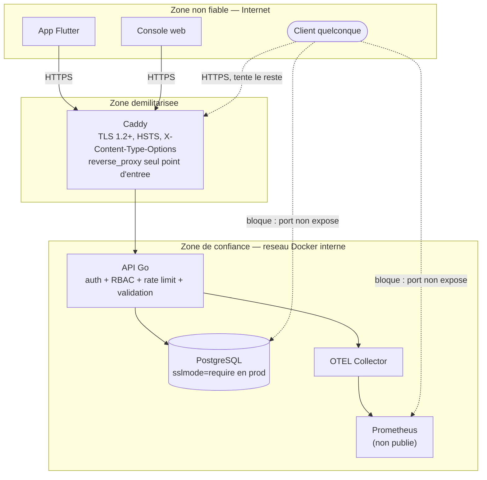
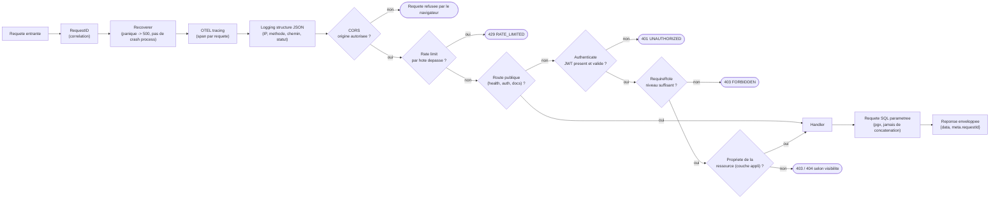

# Schema general de securite

Ce document donne la vue d'ensemble de la securite de StreamPulse : zones
de confiance, defense en profondeur, matrice des roles, et correspondance
avec les principales categories de risque (OWASP Top 10). Il repond au
critere **Ce3.6.1** du bloc 3 (RNCP 38822), qui exige un schema general de
la securite en complement des [user stories](user-stories.md), du
[schema de base de donnees](base-de-donnees.md) et des
[diagrammes UML/BPMN](diagrammes.md).

Ce document est une **synthese transversale** : il ne remplace aucun des
documents suivants, il les relie entre eux.

| Document | Ce qu'il couvre |
|----------|------------------|
| [ADR 006](ADR/006-strategie-auth-jwt.md) | Pourquoi JWT + refresh opaque, pourquoi bcrypt cout 12 |
| [ADR 007](ADR/007-effacement-compte-rgpd.md) | Pourquoi l'effacement est physique et en cascade |
| [rgpd.md](rgpd.md) | Registre des traitements, droits, retention |
| [deployment.md](deployment.md) | TLS, secrets de production, procedure de deploiement |
| [plan-de-tests.md](plan-de-tests.md#4-campagne-de-securite) et [cahier-de-recette.md](cahier-de-recette.md#37-securite) | Preuves executables des mesures listees ici |

Une synthese en anglais figure en fin de document.

## 1. Modele de menaces

| Actif a proteger | Menace principale | Acteur |
|-------------------|--------------------|--------|
| Mots de passe et refresh tokens | Vol par fuite de base ou interception reseau | Attaquant externe |
| Donnees personnelles (email, contenus) | Acces non autorise, exfiltration | Attaquant externe, compte compromis |
| Flux audio en direct | Injection de contenu par un tiers, deni de service | Client abusif, diffuseur usurpe |
| Disponibilite de l'API | Saturation (volumetrie de requetes) | Client abusif, bot |
| Integrite de la base | Injection SQL, mass assignment | Attaquant externe |
| `/metrics` (topologie interne) | Reconnaissance avant attaque | Attaquant externe |
| Image et conteneur en production | Execution de code avec privileges | Attaquant ayant compromis le processus |

## 2. Cartographie des flux et zones de confiance

Trois zones de confiance separent Internet, la zone demilitarisee
(reverse proxy) et le reseau interne Docker, ou seule l'API dialogue avec
la base et l'observabilite. Aucun service autre que Caddy n'est publie sur
Internet en production (`docker-compose.prod.yml`).

**Ce que la frontiere Z0 → Z1 impose** : uniquement HTTPS (redirection HTTP
automatique par Caddy) ; `X-Forwarded-For` n'est cru par l'API que parce
que Caddy est dans `TRUSTED_PROXIES` — un en-tete forge par `Attacker`
depuis Z0 est ignore.

**Ce que la frontiere Z1 → Z2 impose** : `Attacker` ne peut jamais joindre
`PG`, `OTEL` ou `Prom` directement, meme s'il decouvre leurs ports internes
— ils ne sont pas publies par `docker-compose.prod.yml`.

## 3. Defense en profondeur

Chaine reelle des middlewares HTTP, dans l'ordre ou ils s'executent
(`transport/http/router.go`). Une requete qui echoue a une etape n'atteint
jamais la suivante.

Chaque etape est verifiee par un test dedie :
`TestRequestIDIsCorrelatedEndToEnd` (M1/M4), `TestLoadRejectsWildcardCORSInProduction`
(M5), rate limiting (M6, section 5 — voir limite connue), `TestRBAC_EndpointMatrix`
et `TestRequireRoleMatrix` (M8/M9), `TestPlaylists_VisibilityAndOwnership`
(M10), `TestSecurity_SQLInjectionIsNeutralised` (M11).

## 4. Authentification et autorisation

Le detail sequentiel (inscription, connexion, refresh) est dans
[diagrammes.md](diagrammes.md#3-sequence--inscription-connexion-rafraichissement).
Ce qu'il faut retenir au niveau securite :

| Element | Choix | Pourquoi |
|---------|-------|----------|
| Mots de passe | bcrypt, cout 12 (184 ms/verification) | Assez lent pour decourager une attaque par dictionnaire, imperceptible sur un `login` |
| Jeton d'acces | JWT HS256, 15 minutes, claims `user_id`/`email`/`username`/`role` | Fenetre d'exposition bornee ; pas de revocation possible, compromis assume ([ADR 006](ADR/006-strategie-auth-jwt.md)) |
| Refresh token | UUID v4 opaque, 168 h, hache en SHA-256, a usage unique | Revocable ; une fuite de la table ne donne aucun jeton exploitable |
| Autorisation par role | Hierarchie entiere `anonymous(0) < user(1) < broadcaster(2) < admin(3)` | Un seul comparateur (`RequireRole`), sans acces base a chaque requete |
| Autorisation par propriete | Verifiee dans la couche application, separement du role | Etre `broadcaster` autorise a creer un flux, pas a modifier celui d'un autre |

### Matrice RBAC (roles x actions sensibles)

| Action | anonymous | user | broadcaster | admin |
|--------|:---:|:---:|:---:|:---:|
| Consulter la liste des flux (`GET /streams`, `GET /streams/{id}`) | ✅ | ✅ | ✅ | ✅ |
| Consulter le catalogue musical, rechercher (`GET /music`, `GET /search`) | ✅ | ✅ | ✅ | ✅ |
| Consulter une playlist publique (`GET /playlists/public`) | ❌ | ✅ | ✅ | ✅ |
| Ecouter un flux live | ❌ | ✅ | ✅ | ✅ |
| Favoris, playlists privees | ❌ | ✅ | ✅ | ✅ |
| Creer / demarrer / arreter un flux | ❌ | ❌ | ✅ (le sien) | ✅ (le sien) |
| Deposer un morceau | ❌ | ❌ | ✅ (le sien) | ✅ (le sien) |
| Modifier le flux/morceau d'un tiers | ❌ | ❌ | ❌ | ❌ (propriete stricte, meme pour `admin`) |
| Lister / modifier le role des comptes | ❌ | ❌ | ❌ | ✅ |
| Supprimer un compte tiers | ❌ | ❌ | ❌ | ✅ |
| `GET /metrics` | ❌ | ❌ | ❌ | ✅ |
| Signaler un bug ou une suggestion (`POST /feedback`) | ❌ | ✅ | ✅ | ✅ |
| Consulter / traiter les signalements (`GET`, `PUT /admin/feedback*`) | ❌ | ❌ | ❌ | ✅ |

Verifie exhaustivement par `TestRBAC_EndpointMatrix` (chaque route x
chaque role) et `TestRequireRoleMatrix`.

**Ce que "anonymous" recouvre reellement.** Le role `anonymous` n'est jamais
assigne a un compte : c'est l'absence de jeton. Trois routes repondent
effectivement sans authentification (`GET /streams`, `GET /streams/{id}`,
`GET /music*`, `GET /search`), mais **aucun ecran de l'application livree
n'y accede sans compte** — `mobile/lib/app/router.dart` redirige toute
route non authentifiee vers la connexion, sans exception. Ces routes
restent donc atteignables uniquement par un client tiers integre
directement a l'API. `GET /playlists/public` est le cas inverse et source
de confusion frequente : malgre son nom, elle exige un jeton, car elle est
declaree a l'interieur du groupe authentifie du routeur
(`transport/http/router.go`) plutot qu'a cote des trois routes ci-dessus —
"publique" y qualifie la visibilite de la playlist entre utilisateurs
connectes, pas l'acces anonyme.

## 5. Correspondance OWASP Top 10 (2021)

| Categorie | Mesure dans StreamPulse | Ou | Verifie par |
|-----------|--------------------------|-----|-------------|
| A01 Broken Access Control | RBAC par role + controle de propriete par ressource | `middleware/rbac.go`, services applicatifs | `TestRBAC_EndpointMatrix`, `TestPlaylists_VisibilityAndOwnership`, `TestStreams_OwnershipAndErrors` |
| A02 Cryptographic Failures | bcrypt (mots de passe), SHA-256 (refresh tokens), TLS en transit, aucun secret en clair dans le depot | `application/auth_service.go`, `config/config.go`, `.env.example` | `TestAuth_SecretsAreStoredHashed` |
| A03 Injection | Requetes SQL parametrees (pgx, zero concatenation), `DisallowUnknownFields` contre le mass assignment JSON | `infrastructure/postgres/*`, `handlers/response.go` | `TestSecurity_SQLInjectionIsNeutralised`, `TestSecurity_UnknownFieldsRejected` |
| A04 Insecure Design | Roles hierarchises simples plutot que permissions granulaires inutiles ; effacement physique documente et teste plutot qu'un flag `deleted_at` oublie quelque part | [ADR 006](ADR/006-strategie-auth-jwt.md), [ADR 007](ADR/007-effacement-compte-rgpd.md) | — |
| A05 Security Misconfiguration | Joker CORS `*` refuse au demarrage en production ; `/metrics` reserve a `admin` ; en-tetes `HSTS`, `X-Content-Type-Options`, suppression de `Server` | `config/config.go`, `caddy/Caddyfile` | `TestLoadRejectsWildcardCORSInProduction`, `TestMetricsAccess` |
| A06 Vulnerable Components | `govulncheck` en CI sur le module Go, `flutter analyze` cote mobile, scan Trivy de l'image Docker | `.github/workflows/*`, `backend/Dockerfile` | Pipeline CI (`security.yml`) |
| A07 Identification and Authentication Failures | Jeton d'acces court, refresh a usage unique et revocable, meme reponse `401` pour mot de passe faux et compte inconnu | `middleware/auth.go`, `application/auth_service.go` | `TestAuth_ExpiredTokensRejected`, `TestAuthService_Login` |
| A08 Software and Data Integrity Failures | `go.sum` / `pubspec.lock` verrouilles, image construite depuis un Dockerfile versionne et scanne, aucun script tiers charge dynamiquement | `backend/go.sum`, `mobile/pubspec.lock` | Pipeline CI |
| A09 Security Logging and Monitoring Failures | Logs JSON structures correles par `request_id`/`trace_id` ; dashboard Grafana distinguant erreurs techniques et evenements metier ; alertes sur anomalies | `middleware/logging.go`, [ADR 008](ADR/008-dashboard-alertes-grafana.md) | `TestRequestIDIsCorrelatedEndToEnd` |
| A10 Server-Side Request Forgery | Sans objet en l'etat : les seules URLs externes acceptees (`music.url`) sont stockees et redistribuees telles quelles, jamais recuperees cote serveur | `domain/music.go` | — |

## 6. Surface reseau et durcissement des conteneurs

- **TLS** : natif (`TLS_CERT_FILE`/`TLS_KEY_FILE`, TLS 1.2 minimum) ou
  termine par Caddy en amont ; jamais les deux services en clair
  simultanement en production ([deployment.md](deployment.md#https)).
- **Reverse proxy** : seul `caddy` est publie sur Internet
  (`docker-compose.prod.yml`) ; `postgres`, `otel-collector` et
  `prometheus` ne le sont jamais.
- **Rate limiting** : par hote reel, avec prise en compte prudente de
  `X-Forwarded-For` — uniquement depuis une IP listee dans
  `TRUSTED_PROXIES`, parcourue de droite a gauche pour ignorer tout
  segment que le client aurait pu forger (`middleware/ratelimit.go`).
  *Limite connue* : l'anomalie A-01 du [cahier de recette](cahier-de-recette.md)
  a documente un cas ou le rate limiting etait inoperant (comptage par
  `IP:port` au lieu de l'hote) ; corrige, verifie par
  `TestRateLimiterKeyIgnoresSourcePort` et `TestRateLimiterBurstThenReject`.
- **Image Docker** : construction multi-stage (`golang:1.26-alpine` →
  `alpine:3.22`), paquets systeme mis a jour (`apk upgrade`) avant ajout,
  binaire compile en statique (`-s -w`), execution sous utilisateur non
  privilegie (`streampulse`, uid 10001, sans shell) — une execution de code
  arbitraire dans le serveur ne donne pas root dans le conteneur
  (`backend/Dockerfile`).
- **Configuration** : zero secret dans le depot (12-Factor App) ; `JWT_SECRET`
  est obligatoire et sans valeur par defaut, le service refuse de demarrer
  sans lui.

## 7. Limites connues

- Un JWT d'acces vole reste valide jusqu'a son expiration (15 minutes
  maximum) : il n'existe pas de liste de revocation, choix assume pour
  garder le serveur sans etat ([ADR 006](ADR/006-strategie-auth-jwt.md)).
- Le secret JWT est unique et global : le faire tourner invalide toutes
  les sessions en cours, faute de mecanisme de double-secret en periode de
  transition.
- Les fichiers audio uploades ne sont pas chiffres au repos sur le volume
  Docker (seules les donnees en base et en transit le sont) ; a
  reconsiderer si un heberge cloud avec chiffrement natif du stockage est
  adopte.

## Summary (English)

This document is the cross-cutting security overview required by
criterion **Ce3.6.1**, tying together the ADRs, the GDPR register and the
test suite rather than duplicating them. It covers: a lightweight threat
model (assets, threats, actors); a trust-boundary diagram spanning the
internet, the Caddy DMZ and the internal Docker network, where only the
API can reach PostgreSQL or the observability stack; a defense-in-depth
diagram of the actual middleware chain (request ID, panic recovery,
tracing, logging, CORS, rate limiting, JWT authentication, role-based
authorization, ownership checks, parameterised SQL); the authentication
design (bcrypt cost 12, 15-minute HS256 access tokens, single-use hashed
opaque refresh tokens) with a full role x action RBAC matrix; a mapping of
every OWASP Top 10 (2021) category to the concrete mitigation, its
location in the codebase, and the test that verifies it; and container/
network hardening (multi-stage non-root Docker image, TLS termination,
no internal service exposed to the internet). Known limitations —
non-revocable access tokens, a single global signing secret, and
unencrypted-at-rest audio files — are stated explicitly rather than
glossed over.
